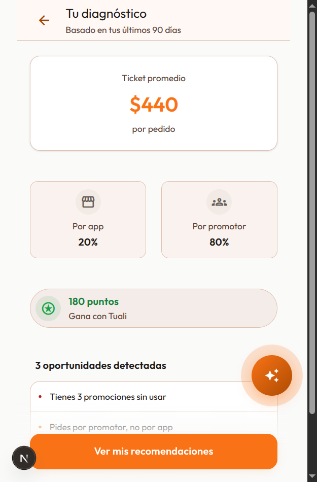
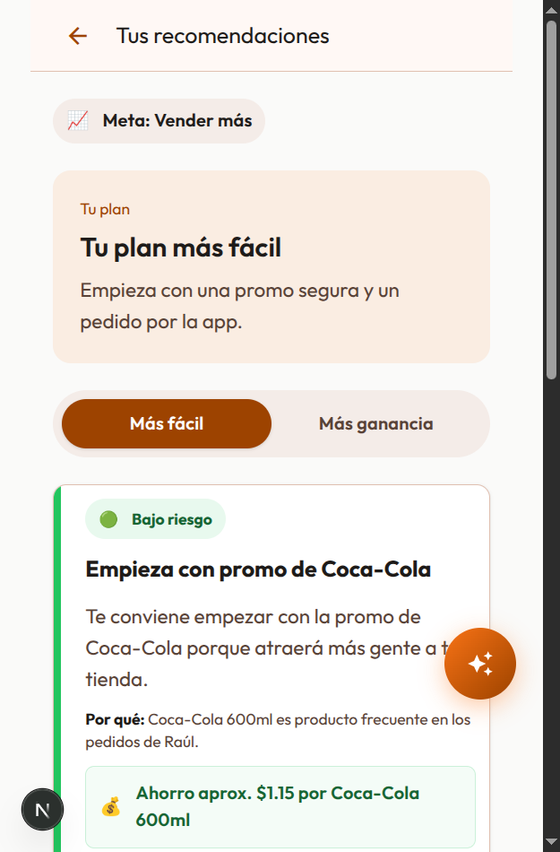

# tuAliado

> Sistema de acompañamiento que convierte metas de negocio en acciones concretas y medibles para dueños de tienda — construido para el reto **Tuali Growth Agent** de Hack4Her.

| | |
|---|---|
| 🚀 **Demo en vivo** | [hack4her-tu-aliado.vercel.app](https://hack4her-tu-aliado.vercel.app/) |
| 🎬 **Video demo** | [Ver en YouTube](https://youtube.com/shorts/Dmv-8YtmCt8?feature=share) |
| 📋 **Devpost** | [devpost.com/software/tualiado](https://devpost.com/software/tualiado) |

[](https://youtube.com/shorts/Dmv-8YtmCt8?feature=share)

---

## El problema

Los dueños de tienda en el ecosistema de Tuali tienen acceso a una app con pedidos, promociones y un programa de loyalty — pero nada dentro de esa app los acompaña a usar esa información para crecer su negocio. Diseñamos para el arquetipo de menor habilidad digital del reto: si el flujo funciona para ese caso, funciona para cualquier perfil más digital.

## La solución

tuAliado convierte una meta de negocio en un plan de acciones concretas con seguimiento continuo, en un flujo lineal de cinco pasos:

```
Diagnóstico → Meta → Recomendaciones → Acción → Seguimiento
```

Un chat flotante (texto y voz) acompaña el flujo para resolver dudas puntuales, pero **no decide nada** — solo explica en lenguaje simple lo que el motor ya calculó.

<p align="center">
  
  
</p>

## Decisión de arquitectura: motor determinístico + LLM como capa de explicación

La parte técnicamente más relevante del proyecto es esta separación:

- **`lib/recommendation-engine.ts`** — funciones puras de TypeScript que calculan diagnóstico y recomendaciones a partir de datos estructurados (`lib/mock-data.ts`). El motor decide *qué* recomendar.
- **`lib/gemini.ts`** — capa delgada sobre la API de Gemini que traduce esas recomendaciones ya calculadas a lenguaje natural. El LLM solo decide *cómo decirlo*.

Esta separación no es un detalle de implementación: es la respuesta directa a un requisito explícito del reto — **cero incoherencia entre los datos mostrados**. Un LLM que improvisa números o recomendaciones puede contradecirse entre pantallas; un motor determinístico no. Y como consecuencia, **si la API de Gemini falla, el producto sigue funcionando** — el flujo completo no depende del LLM, solo pierde la traducción a lenguaje natural (hay plantillas de respaldo en `lib/explicaciones.ts`).

Cada dato del mock está anotado por origen en `lib/types.ts` (`TUALI` / `CLIENTE` / `ESTIMACION`), para que sea trazable de dónde sale cada número que se muestra.

## Cómo correrlo localmente

```bash
npm install
cp .env.example .env.local   # agregar tu GEMINI_API_KEY (ver .env.example)
npm run dev
```

Abre [http://localhost:3000](http://localhost:3000). El proyecto es **mobile-first** (viewport objetivo 375–430px) — usa las dev tools del navegador en modo responsive para verlo como está pensado.

> El producto funciona sin `GEMINI_API_KEY`: el motor de recomendaciones es 100% determinístico y local; sin la key solo se pierde la capa de explicación en lenguaje natural (cae a plantillas de respaldo).

## Estructura del proyecto

```
app/                  Rutas de Next.js App Router — una carpeta por pantalla del flujo
├─ page.tsx           Splash / entrada
├─ onboarding/        Selección de meta (4 botones grandes)
├─ diagnostico/       Estado actual del negocio (ticket, canal, oportunidades)
├─ recomendaciones/   Hasta 3 acciones priorizadas por el motor
├─ registro/          Check-in diario de 2-3 preguntas
├─ seguimiento/       Avance hacia la meta + comparación de canal
└─ api/               Endpoints que llaman a Gemini (chat, explicaciones)

components/           Componentes de UI compartidos (chat flotante, tarjetas, progreso)

lib/                  Toda la lógica de negocio — nada de lógica en componentes
├─ types.ts                   Contratos de datos, con anotación de origen
├─ mock-data.ts               Datos simulados (perfil, pedidos, catálogo, promos)
├─ recommendation-engine.ts   Motor determinístico de diagnóstico y recomendaciones
├─ gemini.ts                  Capa de explicación vía Gemini API (con fallback)
├─ explicaciones.ts           Plantillas de respaldo si el LLM no responde
├─ chat.ts                    Construcción de contexto para el chat
├─ voice.ts                   Wrapper de Web Speech API (STT + TTS)
└─ state.ts                   Manejo de estado vía URL params + localStorage
```

## Camino de demo recomendado

```text
/ → /onboarding → /diagnostico?meta=vender_mas → /recomendaciones?meta=vender_mas → /registro?meta=vender_mas → /seguimiento?meta=vender_mas
```

Se recorre una sola meta ("Vender más") de punta a punta — es la que conecta más directo con la métrica principal (ticket promedio). Más detalle del guion en `docs/demo-flow.md`.

## Stack técnico

- **Framework:** Next.js (App Router) + TypeScript
- **Estilos:** Tailwind CSS — mobile-first, sin breakpoints de escritorio
- **Datos:** módulos TypeScript mock en `lib/mock-data.ts` (no hay datos reales de clientes — ver `docs/data-assumptions.md`)
- **Motor:** funciones puras determinísticas en `lib/recommendation-engine.ts`
- **LLM:** Gemini API, solo como capa de explicación (`lib/gemini.ts`)
- **Voz:** Web Speech API nativa del navegador (`lib/voice.ts`)
- **Deploy:** Vercel

## Documentación adicional

| Archivo | Contenido |
|---|---|
| `docs/mvp-current-direction.md` | Dirección de producto: usuario, métricas, flujo, restricciones de diseño |
| `docs/decisions.md` | Registro de decisiones de producto y arquitectura, con su razón |
| `docs/demo-flow.md` | Guion y camino exacto de la demo |
| `docs/data-assumptions.md` | Qué datos hay, cuáles son reales y cuáles son supuestos del mock |

## Equipo — Picafresitas

| Nombre | Rol |
|---|---|
| Joaquín Rosales González | Ingeniería |
| Fernanda Sánchez Estudillo | Diseño UX/UI |
| Isabel Mejía Franco | Producto / Estrategia |
| Katia Iveth Uribe Briones | Presentación / Pitch |
